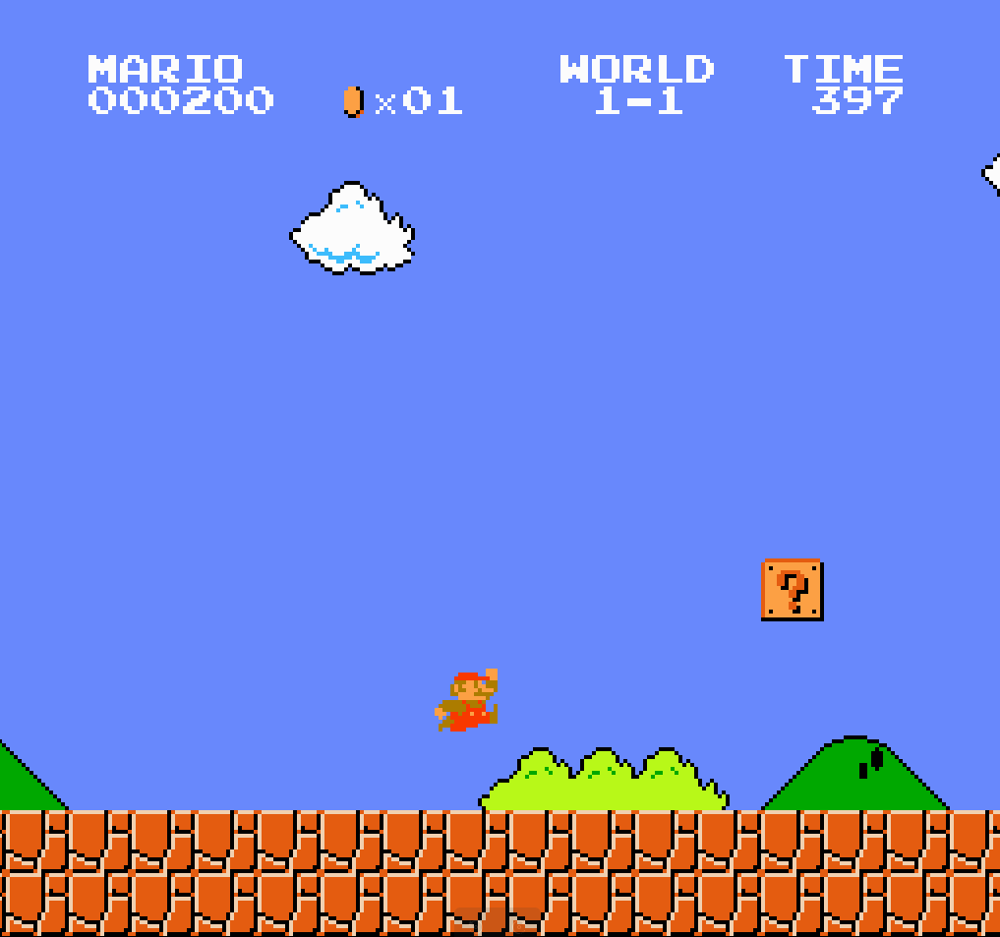

# Mario RL - Deep Reinforcement Learning for Super Mario Bros



Train AI agents to play Super Mario Bros using Deep Q-Networks (DQN) and ResNet architectures with PyTorch.

## Quick Start with Docker

```bash
# Setup environment and dependencies
bash script/docker_dl.sh

# Start training
python train.py --model-name ResNETv1 --episodes 5000
```

## Basic Usage

```bash
# Single GPU training
python train.py --model-name DQN --episodes 5000

# Multi-GPU distributed training
python train.py --distributed --world-size 2 --model-name ResNETv1 --episodes 5000

# Test environment
python simple_mario_test.py
```

## Models Available

- **DQN**: Basic Deep Q-Network
- **ResNETv1**: ResNet-based architecture with multi-frame support
- **VIT**: Experimental Vision Transformer

Training checkpoints saved to `checkpoints/`, gameplay videos to `gameplay_gifs/`.